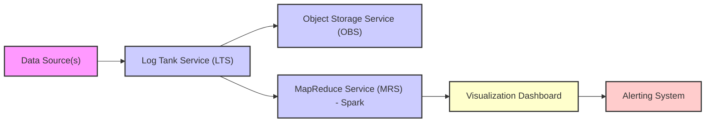

# Real-Time Log Anomaly Detection on Huawei Cloud

## Description
This project implements a real-time log analysis pipeline on Huawei Cloud for detecting anomalies. It ingests logs using Log Tank Service (LTS), stores raw data in Object Storage Service (OBS), processes logs using MapReduce Service (MRS) with Spark for anomaly detection, and visualizes alerts using a Grafana dashboard.

## Architecture

## Components

*   **Log Tank Service (LTS):** Collects and streams logs from various sources.
*   **Object Storage Service (OBS):** Stores raw log data for archival and future analysis.
*   **MapReduce Service (MRS) with Spark:** Processes logs and detects anomalies using machine learning algorithms. Consider using libraries like `scikit-learn` within Spark.
*   **Visualization Dashboard (Grafana):** Visualizes alerts and key metrics derived from the anomaly detection process. Other options include Huawei Cloud's DataArts Studio.
*   **Alerting System:** Triggers alerts based on detected anomalies. This could be integrated with Huawei Cloud's SMS service, email notifications, or other incident management tools.

## Setup

1.  Ensure you have a Huawei Cloud account and have configured the necessary access keys.
2.  Create an LTS topic and configure your log sources to stream logs to the topic.
3.  Create an OBS bucket to store the raw logs.
4.  Set up an MRS cluster with Spark.
5.  Configure a Spark job to read logs from LTS, process them, and detect anomalies. This job should output the detected anomalies to a database or messaging queue.
6.  Deploy the Grafana dashboard using `docker-compose up -d`.  Access the dashboard at `http://localhost:3000` and configure it to visualize data from your anomaly detection output.

## Running the Pipeline

1.  Ingest logs into LTS from your application servers.
2.  The Spark job on MRS will continuously process the logs and detect anomalies.
3.  Grafana will display the anomalies in real-time.

## Configuration

Refer to the Huawei Cloud documentation for specific configuration details for each service.